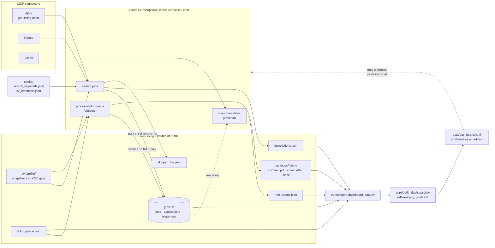

<!-- BANNER: pending my approval -->

<!-- HOOK: 2–4 sentences, WALID writes -->

<h2>The story</h2>

<!-- WALID: short origin story, 5–8 sentences -->

The full build story, version by version, with the bugs that shaped it: **[docs/STORY.md](docs/STORY.md)**.

An agent-run job search: Claude routines find postings through MCP connectors, score them against your CV, prepare tailored applications and track replies, all around one SQLite file and one dashboard, with no model API key.

<!-- Stat badges: every number is counted from the repo; sources are logged in WORKLOG.md -->

<b>The dashboard</b> · review jobs, replies and next steps on one page

 

One HTML file with four tabs: overview, inbox, search radar and all jobs. Every action (approve, discard, tailor, search, interview prep) copies a ready-made prompt for the Claude chat. The page itself has no write access, so a human stays in the loop and nothing changes without you seeing it.

The job detail panel: match and freshness, the invitation and mail history from the reply scan, the skill match, and the next step as a prompt to copy.

Both screenshots use the included demo data. All companies are fictional.

<b>Search and scoring</b> · two sources, few filters, every reject logged

 

- **Two job sources, one pass.** An Apify job-listing actor does a few broad sweeps; the Indeed connector runs many narrow queries. Results are deduplicated on URL **and** on normalised company + title, because some short links change between requests.
- **"Cast wide, then score."** Pre-scoring filters are few and specific, exclusions only demote, and every rejected posting is written to a log with a reason.
- **Scoring by the agent, not a script.** Each new job gets a 0–100 match score, matching and missing skills and a one-line reason, judged against a snapshot of your CV. Jobs under the threshold are never stored.
- **Cheap by design.** The CV is only re-read when its sha256 hash changes, no script calls a model, and the one paid source gets a spending cap on every call.

<b>Tailored applications</b> (optional) · a CV and a cover letter per job

 

A queued job becomes a package: a LaTeX CV cut to a hard page limit and an editable `.docx` cover letter, in the language you set in the config. The rules for both live in one routine file: truthful to your CV, no claimed specialization, content chosen per posting, layout that survives applicant-tracking systems, and a letter that tells a short story instead of listing courses.

<b>Reply tracking</b> (optional) · invited, waiting or rejected

 

A mailbox scan by company name classifies each application as *invited*, *waiting* or *rejected* and shows it in the dashboard's inbox, with a follow-up reminder after 14 days. It only writes its own status file, never the database.

<b>Guardrails</b> · nothing deleted, every write checked

 

- Rows in `jobs.db` are never deleted; only their status changes.
- Every file write is checksummed and read back; stale SQLite journals are cleaned up before connecting.
- The dashboard build refuses a truncated template, verifies its own output and prints `OK` or `BUILD FAILED`. No routine reports success without `OK`.
- Nothing is ever submitted automatically: you apply yourself.

<b>Architecture</b> · routines, connectors, one data folder

 

The Python side is small on purpose: five standard-library modules. The "program" is the three routine files in [`routines/`](routines/), which a Claude agent follows step by step.

| Piece | Role |
|---|---|
| [`routines/search-jobs.md`](routines/search-jobs.md) | Search both sources, filter, dedupe, score, insert, rebuild |
| [`routines/process-tailor-queue.md`](routines/process-tailor-queue.md) | *Optional.* Tailored CV + cover letter per queued job |
| [`routines/scan-mail-status.md`](routines/scan-mail-status.md) | *Optional.* Classify replies from the mailbox |
| [`core/job_database.py`](core/job_database.py) | SQLite schema + CRUD, stale-journal cleanup, `verify()` |
| [`core/safe_io.py`](core/safe_io.py) | Write → fsync → checksum → re-read → retry |
| [`core/export_dashboard_data.py`](core/export_dashboard_data.py) | Read-only export of the data layer to JSON |
| [`core/build_dashboard.py`](core/build_dashboard.py) | Embed the data into the template and verify the result |
| [`core/dashboard_template.html`](core/dashboard_template.html) | The dashboard: one file, no libraries, no network calls |
| [`demo/generate_demo_data.py`](demo/generate_demo_data.py) | A complete fictional data layer for trying it out |

## What I'd build next [CHECK]

> Draft. Replace or confirm.

- **Tests** for the exporter and for the dedupe normalisation (the normalisation currently lives in the routine text, not in code).
- **A small `dedupe.py` helper** so the company+title rule is code the agent calls, not prose it re-implements each run.
- **A light-mode screenshot set** and a language toggle for the dashboard.
- **A dry-run mode for `search-jobs`** that reports what would be inserted without writing to `jobs.db`.
