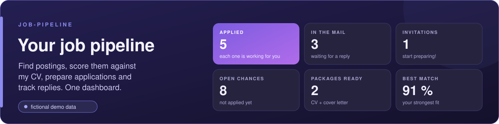
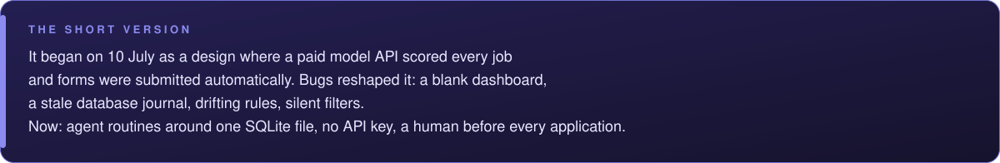
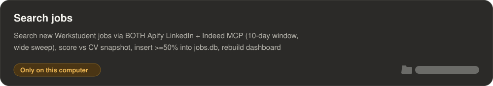
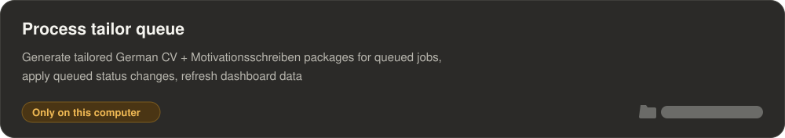
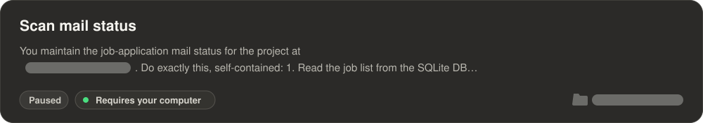
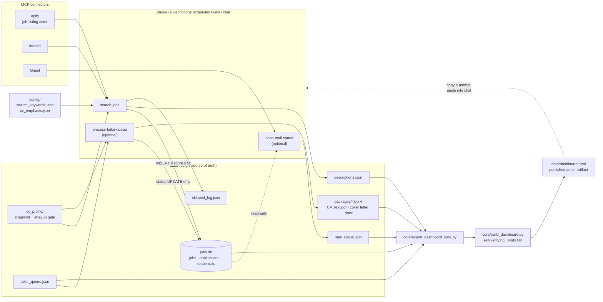

  
  
  
  
  
  

  
  
  
  
  
  
  
  
  

---

> <table>
> <tr><td width="44" valign="top"></td><td valign="top"><b>Four tabs, one HTML file</b> overview, inbox, search radar and all jobs; no libraries, no network calls</td></tr>
> <tr><td width="44" valign="top"></td><td valign="top"><b>Every action copies a prompt</b> approve, discard, tailor, search, interview prep: paste it into the Claude chat The page itself has no write access, so a human stays in the loop and nothing changes without you seeing it.</td></tr>
> </table>

The job detail panel: match and freshness, the invitation and mail history from the reply scan, the skill match, and the next step as a prompt to copy.

Both screenshots use the included demo data. All companies are fictional.

---

> <table>
> <tr><td width="44" valign="top"></td><td valign="top"><b>Two job sources, one pass</b> an Apify job-listing actor does a few broad sweeps; the Indeed connector runs many narrow queries Results are deduplicated on URL <b>and</b> on normalised company + title, because some short links change between requests.</td></tr>
> <tr><td width="44" valign="top"></td><td valign="top"><b>"Cast wide, then score"</b> pre-scoring filters are few and specific, and exclusions only demote Every rejected posting is written to a log with a reason.</td></tr>
> <tr><td width="44" valign="top"></td><td valign="top"><b>Scoring by the agent, not a script</b> a 0–100 match score, matching and missing skills and a one-line reason, judged against a snapshot of your CV Each new job gets scored; jobs under the threshold are never stored.</td></tr>
> <tr><td width="44" valign="top"></td><td valign="top"><b>Cheap by design</b> the CV is only re-read when its sha256 hash changes, and no script calls a model The one paid source gets a spending cap on every call.</td></tr>
> </table>

---

> <table>
> <tr><td width="44" valign="top"></td><td valign="top"><b>A package per queued job</b> a LaTeX CV cut to a hard page limit and an editable <code>.docx</code> cover letter, in the language you set in the config</td></tr>
> <tr><td width="44" valign="top"></td><td valign="top"><b>One rule file</b> the rules for both live in <a href="routines/process-tailor-queue.md"><code>routines/process-tailor-queue.md</code></a> Truthful to your CV, no claimed specialization, content chosen per posting, a layout that survives applicant-tracking systems, and a letter that tells a short story instead of listing courses.</td></tr>
> </table>

---

> <table>
> <tr><td width="44" valign="top"></td><td valign="top"><b>Scan by company name</b> each application is classified as <i>invited</i>, <i>waiting</i> or <i>rejected</i> and shown in the dashboard's inbox</td></tr>
> <tr><td width="44" valign="top"></td><td valign="top"><b>Follow-up reminder</b> shown after 14 days without an answer</td></tr>
> <tr><td width="44" valign="top"></td><td valign="top"><b>Never touches the database</b> it only writes its own status file</td></tr>
> </table>

---

The three routines as they look in Claude's scheduled tasks. Each card links to the section that describes it. The grey bars stand where the folder and the project name would be.

None of the routines runs on a timer, I start them myself (frequency: manual). Search jobs and Process tailor queue show "Only on this computer" because they use local files, so they run only while Claude Desktop is open on my computer. Scan mail status is paused at the moment.

---

> <table>
> <tr><td width="44" valign="top"></td><td valign="top"><b>Nothing is deleted</b> rows in <code>jobs.db</code> are never deleted; only their status changes</td></tr>
> <tr><td width="44" valign="top"></td><td valign="top"><b>Every write is checked</b> each file write is checksummed and read back; stale SQLite journals are cleaned up before connecting</td></tr>
> <tr><td width="44" valign="top"></td><td valign="top"><b>The build verifies itself</b> the dashboard build refuses a truncated template, verifies its own output and prints <code>OK</code> or <code>BUILD FAILED</code> No routine reports success without <code>OK</code>.</td></tr>
> <tr><td width="44" valign="top"></td><td valign="top"><b>You apply yourself</b> nothing is ever submitted automatically</td></tr>
> </table>

---

The Python side is small on purpose: five standard-library modules. The "program" is the three routine files in [`routines/`](routines/), which a Claude agent follows step by step.

> <table>
> <tr><td width="44" valign="top"></td><td valign="top"><b><a href="routines/search-jobs.md"><code>routines/search-jobs.md</code></a></b> search both sources, filter, dedupe, score, insert, rebuild</td></tr>
> <tr><td width="44" valign="top"></td><td valign="top"><b><a href="routines/process-tailor-queue.md"><code>routines/process-tailor-queue.md</code></a></b> <i>optional.</i> Tailored CV + cover letter per queued job</td></tr>
> <tr><td width="44" valign="top"></td><td valign="top"><b><a href="routines/scan-mail-status.md"><code>routines/scan-mail-status.md</code></a></b> <i>optional.</i> Classify replies from the mailbox</td></tr>
> <tr><td width="44" valign="top"></td><td valign="top"><b><a href="core/job_database.py"><code>core/job_database.py</code></a></b> SQLite schema + CRUD, stale-journal cleanup, <code>verify()</code></td></tr>
> <tr><td width="44" valign="top"></td><td valign="top"><b><a href="core/safe_io.py"><code>core/safe_io.py</code></a></b> write → fsync → checksum → re-read → retry</td></tr>
> <tr><td width="44" valign="top"></td><td valign="top"><b><a href="core/export_dashboard_data.py"><code>core/export_dashboard_data.py</code></a></b> read-only export of the data layer to JSON</td></tr>
> <tr><td width="44" valign="top"></td><td valign="top"><b><a href="core/build_dashboard.py"><code>core/build_dashboard.py</code></a></b> embed the data into the template and verify the result</td></tr>
> <tr><td width="44" valign="top"></td><td valign="top"><b><a href="core/dashboard_template.html"><code>core/dashboard_template.html</code></a></b> the dashboard: one file, no libraries, no network calls</td></tr>
> <tr><td width="44" valign="top"></td><td valign="top"><b><a href="demo/generate_demo_data.py"><code>demo/generate_demo_data.py</code></a></b> a complete fictional data layer for trying it out</td></tr>
> </table>

---

> <table>
> <tr><td width="44" valign="top"></td><td valign="top"><b>Try the demo data first</b> a complete fictional data layer, no CV and no connectors needed <code>python demo/generate_demo_data.py</code>, then <code>python core/build_dashboard.py</code></td></tr>
> <tr><td width="44" valign="top"></td><td valign="top"><b>Then make it yours</b> your CV, search settings, connectors and scheduled tasks Follow <b><a href="docs/SETUP.md">docs/SETUP.md</a></b>.</td></tr>
> </table>

---

> <table>
> <tr><td width="44" valign="top"></td><td valign="top"><b>Known limitations</b> what it doesn't do, one line each</td></tr>
> </table>
>
> - It needs a Claude plan with scheduled tasks and connectors, and the Claude desktop app with access to this folder; nothing runs on its own.
> - Not every connector and scheduled-task step in the setup guide has been checked click by click in the app yet.
> - Both job sources are mandatory: if Apify or Indeed fails, the whole search run counts as failed.
> - The Apify job-listing actor you choose may charge per result; every call has a spending cap, but the cost depends on that actor.
> - Whether the Indeed connector costs anything isn't documented here.
> - Match scores are Claude's judgment in each run, not a formula, so the same posting isn't guaranteed the same score twice.
> - There are no automated tests, and the company + title deduplication lives in the routine text, not in code.
> - The dashboard is a snapshot: changes only show after a rebuild and republish.
> - The dashboard's layout overflows sideways at phone width.
> - In light mode, a faint shadow strip shows at the right edge of the dashboard.
> - Without a LaTeX engine, tailored CVs stay as `.tex` source; no PDF is made.
> - The dashboard's interface is English only; the documents follow `output_language` in the config.
>
> <table>
> <tr><td width="44" valign="top"></td><td valign="top"><b>Security scope</b> what stays on your machine and what Claude sees</td></tr>
> </table>
>
> The routines read job postings through the Apify and Indeed connectors and, for the optional reply scan, the mails that match your companies' names through the Gmail connector. They write only to local files in this repository (the SQLite file, JSON files, the application packages and the exported dashboard page) and republish that page as a Claude artifact. The dashboard has no write access, nothing is submitted automatically (you apply yourself), and the routines never delete rows in the database, only change their status. Every file write is checksummed and read back. No model API key is stored anywhere: the logins for Apify, Indeed and Gmail live in Claude's connector settings, not in this repository.
>
> <table>
> <tr><td width="44" valign="top"></td><td valign="top"><b>Built with AI</b> I decided and tested; Claude was the coding assistant</td></tr>
> </table>
>
> I decided what to build and how it should behave, and I tested the result. Claude was the coding assistant. At runtime the pipeline is Claude routines too, on a Claude subscription, with no model API key.
>
> <table>
> <tr><td width="44" valign="top"></td><td valign="top"><b>License</b> MIT, see <a href="LICENSE">LICENSE</a></td></tr>
> </table>

---

How this pipeline got from a per-token API script to agent routines around one SQLite file, reconstructed from dated notes, change logs and archived files. Facts only; all dates are 2026. Where something wasn't recorded, it's left out.

> <table>
> <tr><td width="44" valign="top"></td><td valign="top"><b>Origin</b> why I started building this I was looking for a Werkstudent job, and every application meant the same steps: find postings, check them against my CV, write a CV and cover letter, keep track of replies. I built one place to do that, with Claude as the agent.</td></tr>
> </table>

> <table>
> <tr><td width="44" valign="top"></td><td valign="top"><b>Job search</b> from a paid-API script to a scheduled task and "cast wide, then score"</td></tr>
> </table>
>
> 
>
> <table>
> <tr><td width="150" valign="top"><b>What I built</b></td><td valign="top">A scraping service for job boards, browser automation that would fill in and submit application forms, and SQLite for tracking. A Python analyzer sent every job description to a paid model API for scoring, with a table assigning a model tier to each task by cost and speed. Without an API key it fell back to counting how many known skills appeared in the text.</td></tr>
> <tr><td width="150" valign="top"><b>The bug that shipped</b></td><td valign="top">Every scored job cost money, the fallback was crude, and automatic submission meant no human check before an application went out.</td></tr>
> <tr><td width="150" valign="top"><b>The fix</b></td><td valign="top">Automatic submission was dropped, and scoring moved into the agent.</td></tr>
> </table>
>
> 
>
> <table>
> <tr><td width="150" valign="top"><b>What I built</b></td><td valign="top">A <code>/job-search</code> command ran the scraping actor and the Indeed connector (the second one optional), with four search terms, a 30-day window, and a job-function filter set inside the scraper. The agent scored each job against a separate JSON profile file, assigned tiers, and wrote a markdown digest.</td></tr>
> <tr><td width="150" valign="top"><b>The bug that shipped</b></td><td valign="top">The profile file was separate from the CV and had to be kept in sync, and the scoring script with its paid API was still in the project.</td></tr>
> <tr><td width="150" valign="top"><b>The fix</b></td><td valign="top">See v2.</td></tr>
> </table>
>
> 
>
> <table>
> <tr><td width="150" valign="top"><b>What I built</b></td><td valign="top">The search became a scheduled task. The profile file and the scoring script were retired. Claude reads the master CV once and stores a skills snapshot plus the CV's sha256 hash; every run compares the hash first and re-reads the CV only when it has changed. Scoring happens in the agent turn, with no API call. On 16 July jobs below a match-score threshold stopped being inserted; on 24 July the threshold was raised to 50 and two narrow search queries were added.</td></tr>
> </table>
>
> 
>
> <table>
> <tr><td width="150" valign="top"><b>The bug that shipped</b></td><td valign="top">One of the best-fitting postings of the whole search, an AI and data-analysis role filed under an after-sales department, was missed for a full cycle. Three things caused it at once: search terms with technology words that its title didn't contain, the job-function filter inside the scraper (the role wasn't filed under IT), and a bare "sales" in the exclusion list. Separately, Indeed's short links turned out to change on every request, so URL-only deduplication would have inserted six duplicates in one run, and postings found late in a 30-day window were often already closed.</td></tr>
> <tr><td width="150" valign="top"><b>The fix</b></td><td valign="top"><ul><li>Both sources became mandatory; a source that fails or returns nothing makes the whole run a failure, reported first.</li><li>Bare employment-type terms for the broad source, many narrow queries for Indeed.</li><li>No filters inside the scraper.</li><li>The employment type is checked in title <b>and</b> description, because titles can come back truncated.</li><li>Exclusion became a demotion: override words send a posting to scoring anyway.</li><li>Every rejected posting is logged with a reason.</li><li>Deduplication on normalised company + title as well as URL.</li><li>Scoring judges the work described, not the department.</li><li>The window went from 30 to 10 days, and the scraper's input was checked against its live schema.</li></ul></td></tr>
> </table>
>
> **27 September.** The old slash command was archived; the scheduled task is the only way the search runs.

> <table>
> <tr><td width="44" valign="top"></td><td valign="top"><b>CV tailoring</b> from one sentence in a prompt to one routine with a quality bar</td></tr>
> </table>
>
> 
>
> <table>
> <tr><td width="150" valign="top"><b>What I built</b></td><td valign="top">The first dashboard prompts described tailoring in one line: a CV built from the master, with sections emphasised per job type from a small mapping file. On 12 July the note was to agree on how tailoring should work before generating more packages.</td></tr>
> </table>
>
> 
>
> <table>
> <tr><td width="150" valign="top"><b>What I built</b></td><td valign="top">A <code>/job-tailor</code> command set the basics: a hard two-page limit on the tailored CV, content chosen per posting as a judgment call, a rewritten intro, and one "wildcard" line unrelated to the job.</td></tr>
> <tr><td width="150" valign="top"><b>The fix</b></td><td valign="top">Reviewing the first drafts produced six corrections the same day:<ul><li>the master CV stays complete; only the tailored copy is cut;</li><li>no "(completed)" labels on certificates, only "in progress" where it applies;</li><li>no "with a focus on X" framing in the intro;</li><li>no dashes as sentence connectors and no salesy phrasing;</li><li>nested items as bold name + colon instead of italics + dash;</li><li>the intro as several short sentences in a fixed order: status, relevant experience, interests, languages.</li></ul></td></tr>
> </table>
>
> 
>
> <table>
> <tr><td width="150" valign="top"><b>The bug that shipped</b></td><td valign="top">The scheduled tailoring task had never received the 13 July rules; only the slash command had them. Its run on 16 July produced 16 packages of about four pages each (the master CV with a new intro) and cover letters as PDF instead of Word.</td></tr>
> <tr><td width="150" valign="top"><b>The fix</b></td><td valign="top">The full rule set was written into the task, including a compile-and-count-pages loop, and all 16 packages were redone.</td></tr>
> </table>
>
> 
>
> <table>
> <tr><td width="150" valign="top"><b>What I built</b></td><td valign="top">Working through one CV pass by pass added most of today's layout and wording rules:<ul><li>certificates and skills as separate sections, certificate details taken from the actual certificate documents;</li><li>every heading + bullet list in an unbreakable block, after a block split across a page in a rendered PDF;</li><li>the concrete technology in each bullet in bold;</li><li>the intro as a recruiter summary: no course references, no sentences with an implied third-person subject, no parentheses;</li><li>certificates in the same heading format as education;</li><li>skills as a two-column grid with no orphan single-column row;</li><li>no skill phrase repeated in both the skills section and a project;</li><li>hyphenation off and lists ragged-right, margins 1.5 cm;</li><li>full terms instead of abbreviations a non-technical reader might not know;</li><li>a sweep that replaced explanatory dashes with colons.</li></ul></td></tr>
> <tr><td width="150" valign="top"><b>The bug that shipped</b></td><td valign="top">Every block after the first in a section had a small indent, which misaligned titles and dates. It was found by measuring a rendered PDF.</td></tr>
> <tr><td width="150" valign="top"><b>The fix</b></td><td valign="top"><code>\noindent</code> in the block definition.</td></tr>
> </table>
>
> 
>
> <table>
> <tr><td width="150" valign="top"><b>What I built</b></td><td valign="top">The rules were consolidated into one routine file with an explicit goal: every CV must be readable by applicant-tracking systems (real text, clean reading order, standard headings) and pass a recruiter's few-second skim. Three finished packages became the reference. New checks after compiling: extract the text to confirm the reading order, and render each page to confirm no block was cut.</td></tr>
> </table>
>
> 
>
> <table>
> <tr><td width="150" valign="top"><b>The fix</b></td><td valign="top">The scheduled task stopped carrying its own copy of the rules. It now only points to the routine file and reads it at the start of every run.</td></tr>
> </table>
>
> 
>
> <table>
> <tr><td width="150" valign="top"><b>The bug that shipped</b></td><td valign="top">The master CV's own preamble had drifted from the 19 July typography rules (old margins, hyphenation on, no <code>\noindent</code>). One package's intro still named courses.</td></tr>
> <tr><td width="150" valign="top"><b>The fix</b></td><td valign="top">The preamble was fixed at the source, the PDF is named after the company instead of a generic file name, and the intro was rewritten.</td></tr>
> </table>
>
> 
>
> <table>
> <tr><td width="150" valign="top"><b>The bug that shipped</b></td><td valign="top">A wording was rejected during an interview simulation.</td></tr>
> <tr><td width="150" valign="top"><b>The fix</b></td><td valign="top">Never claim a specialization, focus or qualification that isn't in the CV; describe interests as interests.</td></tr>
> </table>
>
> 
>
> <table>
> <tr><td width="150" valign="top"><b>What I built</b></td><td valign="top">Abbreviations changed from "write them out" to "full term with the abbreviation in brackets the first time, then the abbreviation only", and the output language became a config setting.</td></tr>
> </table>

> <table>
> <tr><td width="44" valign="top"></td><td valign="top"><b>Motivation letter</b> from half a page of LaTeX to an editable Word letter with a plain structure</td></tr>
> </table>
>
> 
>
> <table>
> <tr><td width="150" valign="top"><b>What I built</b></td><td valign="top">The first prompts asked for a letter of about half a page that referred to concrete tasks from the description and mapped them to the profile, written as LaTeX and compiled to PDF.</td></tr>
> </table>
>
> 
>
> <table>
> <tr><td width="150" valign="top"><b>What I built</b></td><td valign="top">The first batch of letters was written as fixed paragraph lists per company inside a generator script and built into Word files. Each followed the same pattern: why this role, two projects as proof, a planned future course as outlook, availability plus a note that a transcript was attached.</td></tr>
> </table>
>
> 
>
> <table>
> <tr><td width="150" valign="top"><b>What I built</b></td><td valign="top">The letter became a native <code>.docx</code>, because it gets edited by hand before sending. One application (CV and letter together) went through six versions that day. For the letter, the changes were: leading with the most relevant course, the Word format, rewording a start date that could be read as an end date, and finally a simpler four-part schema without the dense keyword listing. That schema became the standard: interest in the role, what was learned in a course and how it connects to a project, a broader interest tied to a future elective, availability.</td></tr>
> </table>
>
> 
>
> <table>
> <tr><td width="150" valign="top"><b>The bug that shipped</b></td><td valign="top">The 16 July run had shipped letters as PDF/LaTeX.</td></tr>
> <tr><td width="150" valign="top"><b>The fix</b></td><td valign="top">They were regenerated as Word files.</td></tr>
> </table>
>
> 
>
> <table>
> <tr><td width="150" valign="top"><b>The fix</b></td><td valign="top">The four-part schema was dropped. The new structure: an opening with concrete matching skills and no filler, a middle with one completed-course proof point and one project, an honest sentence where a required skill is missing, and a closing with availability only (no remote/on-site remarks, no transcript unless asked).</td></tr>
> </table>
>
> 
>
> <table>
> <tr><td width="150" valign="top"><b>The bug that shipped</b></td><td valign="top">Feedback on the language level, and on letters that mainly talked about courses.</td></tr>
> <tr><td width="150" valign="top"><b>The fix</b></td><td valign="top"><ul><li>everyday language with short sentences;</li><li>research the company first and open with one specific, true connection;</li><li>a short narrative with one or two proof points instead of a list of courses;</li><li>only completed courses as proof;</li><li>the earlier reference letters were retired.</li></ul></td></tr>
> </table>
>
> 
>
> <table>
> <tr><td width="150" valign="top"><b>The fix</b></td><td valign="top">The no-specialization rule applies to letters too.</td></tr>
> </table>
>
> 
>
> <table>
> <tr><td width="150" valign="top"><b>What I built</b></td><td valign="top">Written down as explicit rules: name 2–3 concrete tasks from the posting, greet a named contact person by name, write start dates so they can't be read as end dates, abbreviations in full the first time, and the output language as a setting.</td></tr>
> </table>

> <table>
> <tr><td width="44" valign="top"></td><td valign="top"><b>Dashboard</b> from a data layer to a page that copies prompts instead of writing</td></tr>
> </table>
>
> 
>
> <table>
> <tr><td width="150" valign="top"><b>What I built</b></td><td valign="top">The v1 design defined the SQLite schema (jobs, applications, responses). A cleanup on 11 July deleted six dead scripts, moved job descriptions out of the jobs table into a separate JSON file keyed by job id, and created the database.</td></tr>
> </table>
>
> 
>
> <table>
> <tr><td width="150" valign="top"><b>What I built</b></td><td valign="top">The prompt written for building the dashboard planned a Cowork artifact that would call Cowork's tools directly: <code>callMcpTool</code> to reach a shell tool and query the database, <code>runScheduledTask</code> to start the tailoring task from a button, and <code>askClaude</code> for a quick three-sentence draft of a cover letter, labelled as a draft. As a fallback, an exporter would write the data to a JSON snapshot that the page reads.</td></tr>
> </table>
>
> 
>
> <table>
> <tr><td width="150" valign="top"><b>What I built</b></td><td valign="top">The notes record that the first dashboard was live as an artifact on 12 July; no file of it was archived. The oldest archived template, v2, is dated the same day. It probes a list of tool names through <code>callMcpTool</code> and switches to "live" if one answers, otherwise to a read-only snapshot mode.</td></tr>
> <tr><td width="150" valign="top"><b>The bug that shipped</b></td><td valign="top">Without the bridge, its buttons only showed messages to do the step in the chat or to start the task from the sidebar, and the draft preview reported that <code>askClaude</code> wasn't available.</td></tr>
> </table>
>
> 
>
> <table>
> <tr><td width="150" valign="top"><b>The bug that shipped</b></td><td valign="top">Writing to the database directly on the synced folder failed with <code>disk I/O error</code> and left a stale journal file behind; files already opened in a viewer couldn't be overwritten. On 14 July a scheduled run hit the same database error, and separately the dashboard rendered blank because its template had been cut off in the middle of a script block.</td></tr>
> <tr><td width="150" valign="top"><b>The fix</b></td><td valign="top">The reliability layer was added that day (<code>core/safe_io.py</code>, <code>core/job_database.py</code>, the self-verifying <code>core/build_dashboard.py</code>), and a setup script that would have overwritten the live database was deleted.</td></tr>
> </table>
>
> 
>
> <table>
> <tr><td width="150" valign="top"><b>The fix</b></td><td valign="top">The exporter started hiding jobs below the match threshold from the dashboard.</td></tr>
> </table>
>
> 
>
> <table>
> <tr><td width="150" valign="top"><b>What I built</b></td><td valign="top">The current layout: four tabs (overview, inbox, search radar, all jobs), a slide-in detail panel and a tailoring tray. When a live action fails, the page falls back to a "copy for Claude" button: it copies a ready-made prompt, you paste it into the chat, and Claude does the step.</td></tr>
> </table>
>
> 
>
> <table>
> <tr><td width="150" valign="top"><b>The bug that shipped</b></td><td valign="top">A cleanup confirmed that the bridge had never been connected: no tools were enabled for the artifact when it was published.</td></tr>
> <tr><td width="150" valign="top"><b>The fix</b></td><td valign="top">The copy-paste handoff was kept as the intended design, not a workaround:<ul><li>the dashboard has no write access at all; every change goes through a chat where you see it before it happens;</li><li>each copied prompt is self-contained (job, company, the exact change, the "never delete" rule), so it works in any Claude session;</li><li>nothing on the page depends on a runtime feature being available.</li></ul></td></tr>
> </table>
>
> 
>
> <table>
> <tr><td width="150" valign="top"><b>The bug that shipped</b></td><td valign="top">Stray null bytes from a damaged write were in the master CV. In the dashboard, a hidden bar still showed as an empty box, and the empty tailoring tray peeked out at the bottom.</td></tr>
> <tr><td width="150" valign="top"><b>The fix</b></td><td valign="top">The null bytes were removed; for the public version the bridge code was removed from the template, the UI was translated to English, and both layout bugs were fixed.</td></tr>
> </table>

> <table>
> <tr><td width="44" valign="top"></td><td valign="top"><b>Tools and connectors</b> what came in, what it solved, what it replaced</td></tr>
> </table>
>
> | Tool | Came in | Solved | Replaced |
> |---|---|---|---|
> | Paid scoring API | the 10 July design (`job_analyzer.py` with a model-selection module) | automatic match scoring, with a table choosing a model tier per task by cost and speed | retired 14 July, replaced by scoring inside the agent run |
> | Apify | chosen in the 10 July design for scraping job boards | pre-built actors, handling of bot protection, low cost per job (the design's reasons) | earlier local scraping scripts (the v1 approach, archived 29 July). On 5 August the actor was pinned, its input checked against the live schema, filters inside the actor removed, and every call given a spending cap |
> | Indeed connector | the v1 search command (around 11–12 July), as an optional second source | a second job source with exact posting dates | Indeed results collected into a JSON file by the earlier local scripts (archived). On 5 August it became mandatory, with many narrow queries because it returns about 10 results per query |
> | Gmail connector | planned in the dashboard prompts of 10–12 July ("no IMAP passwords in code"); the mail-scan task was created on 14 July | reply tracking by company name, classified as invited / waiting / rejected, without any mail credentials in the project. The same day its results were used to mark eight jobs as applied | a `/job-track` command (12 July) that wrote replies into the database's responses table; the dashboard reads the scan's `mail_status.json` instead |
> | Cowork scheduled tasks | the tailoring task on 12 July (manual trigger, no schedule), the mail scan and the search on 14 July | running the routines on the Claude subscription, without an API key | manual sessions and slash commands; the old search command was archived on 27 September. Since 29 July the tasks only point to the routine files |
> | Artifact publishing | 12 July, when the first dashboard went live as an artifact | one page to review jobs, see replies and trigger the next step, updated in place by every routine | before: the v1 search wrote a markdown digest after each run |
> | CV snapshot with hash check | 14 July | scoring and tailoring always read the current CV, but only re-read it when its sha256 hash changes, so an unchanged CV costs nothing | a separate JSON profile file and the script that synced it from the CV |
> | SQLite | the 10 July design; the database was created on 11 July | one queryable source of truth for jobs, applications and replies, where rows are never deleted, only their status changes | a legacy JSON job list (archived 13 July) |

> <table>
> <tr><td width="44" valign="top"></td><td valign="top"><b>The bugs that changed the design</b> nine of them, each with what it changed</td></tr>
> </table>
>
> | When | Bug | What went wrong | What changed |
> |---|---|---|---|
> | 14 July | **Blank dashboard from a truncated template** | A write "succeeded" but the file was cut off, and the build embedded data into it and reported success. | Every write is checksummed and re-read, and the build verifies its own output and prints `OK` or `BUILD FAILED`; no routine reports success without `OK`. |
> | 14 July | **Stale database journal → `disk I/O error`** | An interrupted write on a synced folder left a journal file that blocked the next connection. | The database layer cleans up known leftovers before connecting, retries once, and verifies the database after every batch of writes. |
> | 14 July | **Scoring through a paid API, with a crude fallback** | — | All judgment moved into the agent run, and the CV snapshot with a hash check keeps runs cheap without any model bill. |
> | 16–17 July | **Scheduled-task drift → 16 four-page CVs** | Rules had been added to one copy of the prompt, not the one that ran. | Rules live in exactly one routine file, and scheduled tasks only point to it (made permanent on 29 July). |
> | 18 July | **A heading and its list split across two pages** | — | Entries became unbreakable blocks, and the rendered PDF is checked, not just the source. |
> | 29 July | **The live bridge had never been connected** | — | The copy-to-chat handoff became the design; the dashboard has no write access. |
> | 30 July | **The master CV's own template had drifted from the rules** | — | Rules are fixed at the source file, not only in the newest output. |
> | 5 August | **Silent filters removed the best job** | A bare word in the exclusion list, a filter inside the scraper and tech-qualified search terms could each drop a good match before scoring, and nothing recorded it. | Cast wide, then score; exclusions became a demotion; every reject is logged with a reason. |
> | 5 August | **Rotating short links would have created six duplicates** | — | Deduplication on the posting's identity (normalised company + title), not only its URL. |

> <table>
> <tr><td width="44" valign="top"></td><td valign="top"><b>All 33 fixes</b> date, what broke, what it taught</td></tr>
> </table>
>
> 

> 
Show the full list (date – what broke – what it taught)

>
> 1. 10 Jul – design relied on automatic form submission and paid per-task model calls – keep a human before every application; keep the model inside the run.
> 2. 11 Jul – six dead scripts left over from the first design – delete what isn't used.
> 3. 11 Jul – job descriptions stored in the jobs table – keep lists lean; load large text by id from a separate file.
> 4. 13 Jul – direct database writes on the synced folder failed and left a stale journal – round-trip through local disk; truncate stale journals.
> 5. 13 Jul – files already opened in a viewer couldn't be overwritten – write under a new name and say which file is current.
> 6. 13 Jul – an unrelated legacy job list sat next to the live database – archive what isn't part of the pipeline.
> 7. 14 Jul – a setup script would have overwritten the live database – remove destructive scripts; guard generators with `--force`.
> 8. 14 Jul – scoring called a paid API, with a keyword-count fallback – score in the agent run against a hash-gated CV snapshot.
> 9. 14 Jul – scheduled run failed with `disk I/O error` from a stale journal – clean up before connecting, retry once, verify after writing.
> 10. 14 Jul – dashboard rendered blank from a truncated template – checksum every write; make the build verify itself.
> 11. 14 Jul – jobs that had been applied to weren't marked as applied – reconcile the database with the mail record.
> 12. 16 Jul – low-match jobs cluttered the dashboard – filter them in the exporter as a second safety net.
> 13. 16–17 Jul – the scheduled task never got the new rules → 16 four-page CVs and PDF letters – one copy of the rules, and tasks that only point to it.
> 14. 18 Jul – a heading and its list split across pages – wrap each entry in an unbreakable block.
> 15. 18–19 Jul – stray indent on every block after the first – `\noindent` in the block definition; measure rendered output.
> 16. 18 Jul – wide gaps after disabling hyphenation, and an orphan single-column skill row – ragged-right lists; merge categories into a full grid.
> 17. 24 Jul – the match threshold was too low – raise it to 50.
> 18. 29 Jul – two empty script files and an empty folder – delete leftovers.
> 19. 29 Jul – the dashboard's live bridge had never been connected – copy-to-chat is the design; the page needs no write access.
> 20. 29 Jul – duplicated rules could drift again – the task reads the routine file at runtime.
> 21. 29 Jul – a job's notes claimed a package existed when no folder did – don't trust status notes; check the files.
> 22. 30 Jul – the master CV's preamble had drifted from the typography rules – fix rules at the source.
> 23. 5 Aug – a bare "sales" exclusion discarded an after-sales AI role before scoring – exclusions must be specific; override words send jobs to scoring.
> 24. 5 Aug – a bare "internship" exclusion dropped combined internship/working-student postings – the same lesson, a second time.
> 25. 5 Aug – a job-function filter inside the scraper removed cross-functional roles – no filtering before you can see the posting.
> 26. 5 Aug – a title-only check missed truncated titles – check title and description.
> 27. 5 Aug – a 30-day window surfaced postings that were already closed – a 10-day window.
> 28. 5 Aug – rotating short links broke URL-only deduplication – deduplicate on normalised company + title too.
> 29. 5 Aug – rejected postings were discarded silently – log every reject with a reason.
> 30. 5 Aug – the scraper's input had never been checked against its schema – verify tool inputs against the live schema.
> 31. by 5 Aug – `add_job()` didn't reliably return the new row id after a retry – read the id before committing (fixed in the public version).
> 32. 27 Sep – null bytes at the end of the master CV from a damaged write – check files written to synced folders.
> 33. 28 Sep – a hidden bar rendered as an empty box, and the empty tray peeked out – CSS `display` rules can override `hidden`; test the empty states.
>
> 

