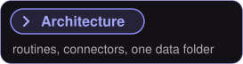
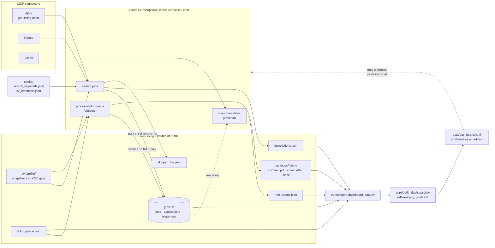
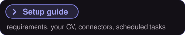
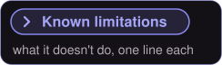

<!-- BANNER: pending my approval -->

<!-- HOOK: 2–4 sentences, WALID writes -->

An agent-run job search: Claude routines find postings through MCP connectors, score them against your CV, prepare tailored applications and track replies, all around one SQLite file and one dashboard, with no model API key.

<!-- Stat badges: every number is counted from the repo -->

  
  
  
  
  

  
  

---

Read the short version

 

<!-- WALID: short origin story, 5–8 sentences -->

The full build story, version by version, with the bugs that shaped it: **[docs/STORY.md](docs/STORY.md)**.

---

More about the dashboard

 

One HTML file with four tabs: overview, inbox, search radar and all jobs. Every action (approve, discard, tailor, search, interview prep) copies a ready-made prompt for the Claude chat. The page itself has no write access, so a human stays in the loop and nothing changes without you seeing it.

The job detail panel: match and freshness, the invitation and mail history from the reply scan, the skill match, and the next step as a prompt to copy.

Both screenshots use the included demo data. All companies are fictional.

More about search and scoring

 

- **Two job sources, one pass.** An Apify job-listing actor does a few broad sweeps; the Indeed connector runs many narrow queries. Results are deduplicated on URL **and** on normalised company + title, because some short links change between requests.
- **"Cast wide, then score."** Pre-scoring filters are few and specific, exclusions only demote, and every rejected posting is written to a log with a reason.
- **Scoring by the agent, not a script.** Each new job gets a 0–100 match score, matching and missing skills and a one-line reason, judged against a snapshot of your CV. Jobs under the threshold are never stored.
- **Cheap by design.** The CV is only re-read when its sha256 hash changes, no script calls a model, and the one paid source gets a spending cap on every call.

More about tailored applications

 

A queued job becomes a package: a LaTeX CV cut to a hard page limit and an editable `.docx` cover letter, in the language you set in the config. The rules for both live in one routine file: truthful to your CV, no claimed specialization, content chosen per posting, layout that survives applicant-tracking systems, and a letter that tells a short story instead of listing courses.

More about reply tracking

 

A mailbox scan by company name classifies each application as *invited*, *waiting* or *rejected* and shows it in the dashboard's inbox, with a follow-up reminder after 14 days. It only writes its own status file, never the database.

---

More about the guardrails

 

- Rows in `jobs.db` are never deleted; only their status changes.
- Every file write is checksummed and read back; stale SQLite journals are cleaned up before connecting.
- The dashboard build refuses a truncated template, verifies its own output and prints `OK` or `BUILD FAILED`. No routine reports success without `OK`.
- Nothing is ever submitted automatically: you apply yourself.

More about the architecture

 

The Python side is small on purpose: five standard-library modules. The "program" is the three routine files in [`routines/`](routines/), which a Claude agent follows step by step.

| Piece | Role |
|---|---|
| [`routines/search-jobs.md`](routines/search-jobs.md) | Search both sources, filter, dedupe, score, insert, rebuild |
| [`routines/process-tailor-queue.md`](routines/process-tailor-queue.md) | *Optional.* Tailored CV + cover letter per queued job |
| [`routines/scan-mail-status.md`](routines/scan-mail-status.md) | *Optional.* Classify replies from the mailbox |
| [`core/job_database.py`](core/job_database.py) | SQLite schema + CRUD, stale-journal cleanup, `verify()` |
| [`core/safe_io.py`](core/safe_io.py) | Write → fsync → checksum → re-read → retry |
| [`core/export_dashboard_data.py`](core/export_dashboard_data.py) | Read-only export of the data layer to JSON |
| [`core/build_dashboard.py`](core/build_dashboard.py) | Embed the data into the template and verify the result |
| [`core/dashboard_template.html`](core/dashboard_template.html) | The dashboard: one file, no libraries, no network calls |
| [`demo/generate_demo_data.py`](demo/generate_demo_data.py) | A complete fictional data layer for trying it out |

---

Start with the demo data, then follow **[docs/SETUP.md](docs/SETUP.md)** to connect your own CV, search settings, connectors and scheduled tasks.

Standalone prompts, to paste into any Claude chat without the pipeline: [set up your profile](docs/prompts/set-profile.md), [job search](docs/prompts/search-jobs.md), [CV tailoring](docs/prompts/cv-tailoring.md), [motivation letter](docs/prompts/motivation-letter.md).

---

Show the known limitations

 

- It needs a Claude plan with scheduled tasks and connectors, and the Claude desktop app with access to this folder; nothing runs on its own.
- Not every connector and scheduled-task step in the setup guide has been checked click by click in the app yet.
- Both job sources are mandatory: if Apify or Indeed fails, the whole search run counts as failed.
- The Apify job-listing actor you choose may charge per result; every call has a spending cap, but the cost depends on that actor.
- The Indeed connector was free on my plan; check yours.
- Match scores are Claude's judgment in each run, not a formula, so the same posting isn't guaranteed the same score twice.
- There are no automated tests, and the company + title deduplication lives in the routine text, not in code.
- The dashboard is a snapshot: changes only show after a rebuild and republish.
- The dashboard's layout overflows sideways at phone width.
- In light mode, a faint shadow strip shows at the right edge of the dashboard.
- Without a LaTeX engine, tailored CVs stay as `.tex` source; no PDF is made.
- The dashboard's interface is English only; the documents follow `output_language` in the config.

Show the security scope

 

Everything runs on your machine, inside your Claude app. Your CV and job data stay in `profile/` and `data/`, which are gitignored, so nothing from them is uploaded to this repository. Claude reads them while a run is going. The job postings come from scraping, you never type them in.

No license file on purpose: this repo is for reading only, not for reuse.
