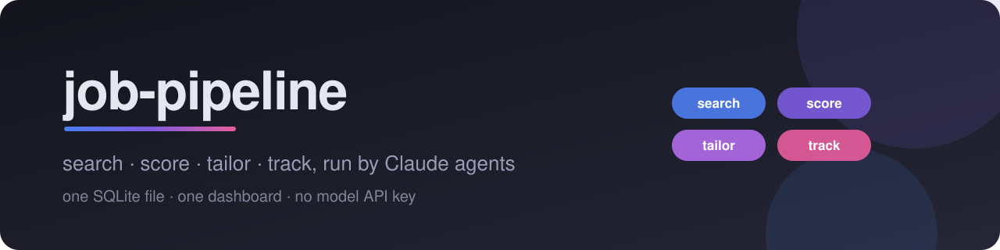
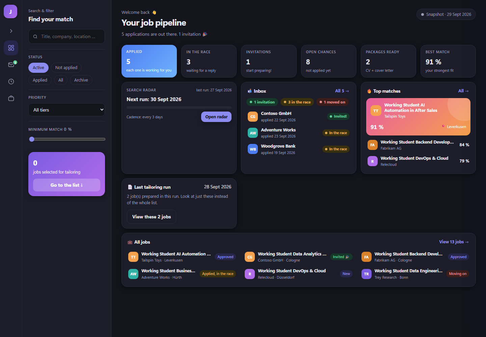
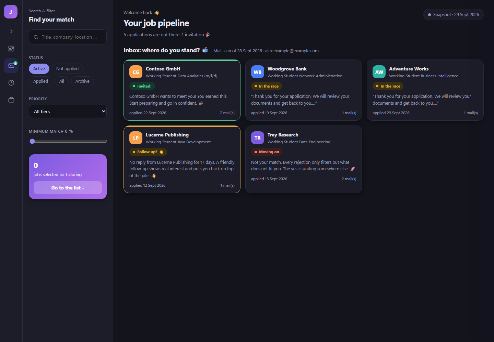
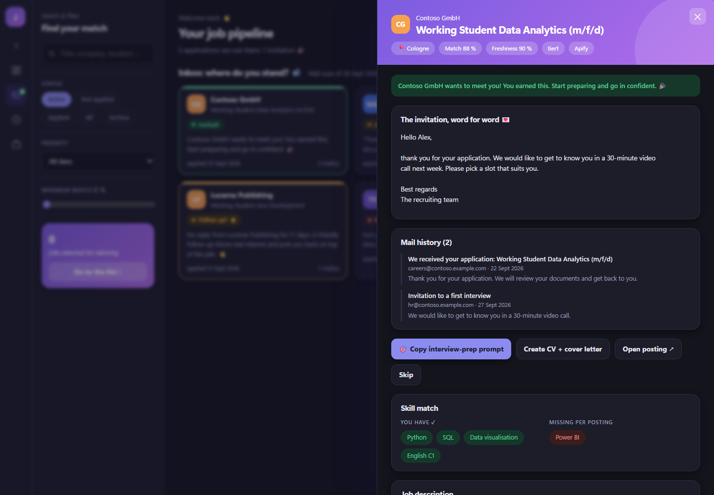
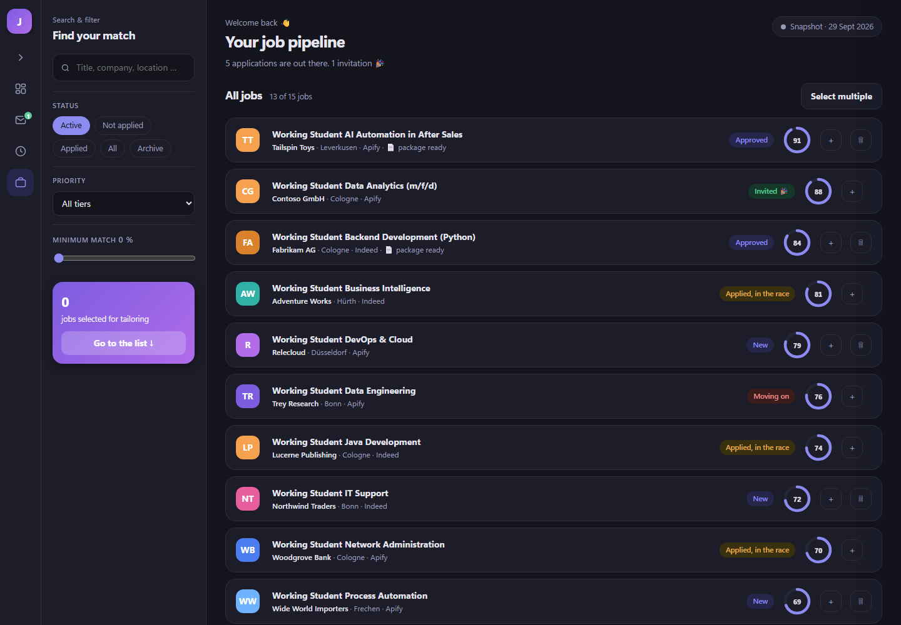
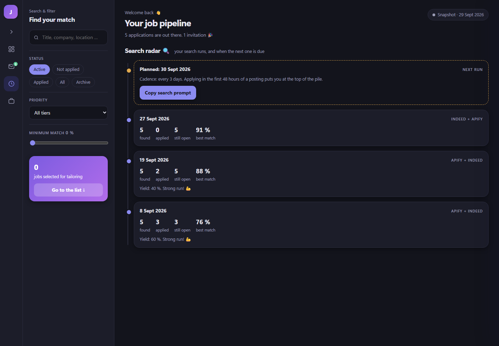
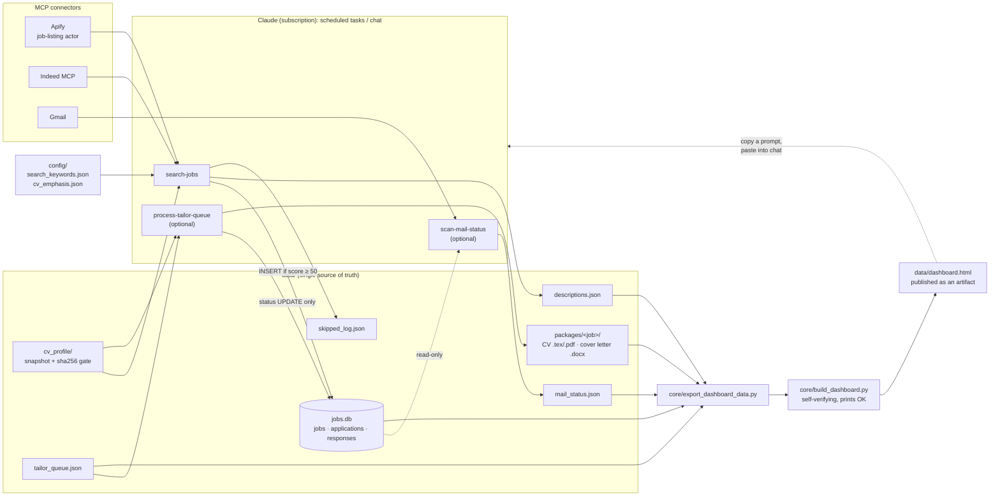

<p align="center">
  
</p>

<p align="center">
  
  
  
  
  
  
  
</p>

**An agent-run job search: Claude routines find postings through MCP connectors, score them against your CV, prepare tailored applications, and track replies, all around one SQLite file and one dashboard, with no model API key.**

<p align="center">
  
  <br><sub>The dashboard, built from the included demo data. All companies are fictional.</sub>
</p>

---

## Features

- **Two job sources, one pass.** An Apify job-listing actor does a few broad sweeps; the Indeed MCP runs many narrow queries. Results are merged and deduplicated on URL **and** on normalised company + title, because some short links rotate between requests.
- **Scoring by the agent, not a script.** Each new job gets a 0-100 match score, matching and missing skills, and a one-line reason, judged against a snapshot of your CV. Jobs under 50 are never inserted, only logged.
- **"Cast wide, then score."** Pre-scoring filters are few and specific, and every rejected posting is written to `skipped_log.json` with a reason, so you can audit what the filters are eating.
- **Cheap by design.** The CV is only re-read when its sha256 changes. There is no model API: all reasoning runs inside Claude on your subscription. The one paid source (the Apify actor) gets a hard spending cap on every call.
- **Tailored applications (optional).** A queued job becomes a package: a LaTeX CV cut to two pages and an editable `.docx` cover letter, written by rules that live in one routine file.
- **Reply tracking (optional).** A mailbox scan by company name classifies each application as *invited*, *waiting* or *rejected* and shows it in the Inbox tab, with a follow-up nudge after 14 days.
- **A dashboard with no write access.** A single HTML file with four tabs (overview, inbox, search radar, all jobs). Every action (approve, discard, tailor, search, interview prep) copies a ready-made prompt for the Claude chat. A human stays in the loop, and the page can't change your data.
- **Guardrails in the data layer.** Rows in `jobs.db` are never deleted, only their status changes. Every write is checksummed and re-read. The dashboard build refuses a truncated template and verifies its own output before it prints `OK`.

<table>
  <tr>
    <td></td>
    <td></td>
  </tr>
  <tr>
    <td></td>
    <td></td>
  </tr>
</table>

## Architecture



The Python side is small on purpose: five standard-library modules. The "program" is the three routine files in [`routines/`](routines/), which a Claude agent follows step by step.

| Piece | Role |
|---|---|
| [`routines/search-jobs.md`](routines/search-jobs.md) | Search both sources, filter, dedupe, score, insert, rebuild |
| [`routines/process-tailor-queue.md`](routines/process-tailor-queue.md) | *Optional.* Tailored CV + cover letter per queued job |
| [`routines/scan-mail-status.md`](routines/scan-mail-status.md) | *Optional.* Classify replies from the mailbox |
| [`core/job_database.py`](core/job_database.py) | SQLite schema + CRUD, stale-journal cleanup, `verify()` |
| [`core/safe_io.py`](core/safe_io.py) | Write → fsync → checksum → re-read → retry |
| [`core/export_dashboard_data.py`](core/export_dashboard_data.py) | Read-only export of the data layer to JSON |
| [`core/build_dashboard.py`](core/build_dashboard.py) | Embed the data into the template and verify the result |
| [`core/dashboard_template.html`](core/dashboard_template.html) | The dashboard: one file, no libraries, no network calls |
| [`demo/generate_demo_data.py`](demo/generate_demo_data.py) | A complete fictional data layer for trying it out |

---

## Setup guide

### 1. Requirements

| You need | For | Notes |
|---|---|---|
| **Python 3.9+** | the scripts in `core/` and `demo/` | standard library only, nothing to `pip install` |
| **A Claude plan with connectors and scheduled tasks** | running the routines | the Claude desktop app; the routines need access to this folder |
| **Apify account** | job search, source 1 | the actor you pick may bill per result |
| **Indeed MCP connector** | job search, source 2 | |
| **Gmail connector** | *optional* reply tracking | |
| **LaTeX** (`tectonic` or `pdflatex`) + poppler (`pdfinfo`, `pdftotext`) | *optional* CV PDFs | without it, packages contain the `.tex` only |

No `ANTHROPIC_API_KEY` is needed or used: no script in this repository calls a model.

### 2. Install and try the demo

```bash
git clone <your-fork-url> job-pipeline
cd job-pipeline
python demo/generate_demo_data.py
python core/build_dashboard.py
```

Open `data/dashboard.html` in a browser. You should see the dashboard from the screenshots, filled with 15 fictional jobs. `build_dashboard.py` must end with a line starting with `OK`; anything else is a failed build.

`generate_demo_data.py` refuses to run if `data/jobs.db` already exists, so it can't overwrite real data by accident. Use `--force` to replace demo data.

### 3. Configure

1. **Environment** (optional). Copy `.env.example` to `.env` if you want the data somewhere other than `data/`. It holds `JOB_PIPELINE_DATA_DIR` and `PYTHONIOENCODING` only: **no keys belong in this repo.**
2. **Search.** Copy `config/search_keywords.example.json` to `config/search_keywords.json` and edit:
   - `target`: role type, home location, country, radius. The demo setup is working-student roles around Cologne.
   - `broad_sweeps.apify` and `priority_searches.indeed`: your search terms.
   - `hard_filters`: required words, soft exclusions, location lists, maximum age.
   - `apify.actor_id`: `<your-apify-actor-id>`. **Any Apify actor that returns job listings works.** Put the actor's own input fields into `apify.actor_input` and keep `max_total_charge_usd` as a spending cap.
3. **CV emphasis** (only if you use tailoring). Copy `config/cv_emphasis.example.json` to `config/cv_emphasis.json` and match the section names to your CV.
4. **Your CV.** Copy `templates/master_cv.example.tex` to `profile/master_cv.tex` and replace the demo person with yourself. Keep it complete; the tailoring routine does the cutting. The first search run builds `data/cv_profile/` from it.
5. **Start with an empty database** (instead of demo data):
   ```bash
   python core/job_database.py
   ```

`data/`, `profile/`, `.env` and your filled-in configs are in `.gitignore`, so your real data stays out of version control.

### 4. Connect the MCP connectors in Claude

Add the connectors in the Claude desktop app under **Settings → Connectors**:

| Connector | How | Used by |
|---|---|---|
| **Apify** | Add it from the connector directory, or add a custom connector with Apify's MCP server URL (`https://mcp.apify.com`), then sign in to Apify. | `search-jobs` (tools `call-actor`, `get-dataset-items`) |
| **Indeed** | Add it from the connector directory. | `search-jobs` (`search_jobs`), tailoring (`get_job_details` for missing descriptions) |
| **Gmail** | Add Google's Gmail connector and sign in with the mailbox you apply from. | `scan-mail-status` (optional) |

Your Apify token and the Indeed and Gmail logins stay in Claude's connector settings. Nothing is stored in this repository.

If you use Claude Code instead, the Apify server can be added from the terminal:

```bash
claude mcp add --transport http apify https://mcp.apify.com
```

### 5. Set up the scheduled tasks

Create one scheduled task per routine in the Claude desktop app and give it access to this folder. **Keep the task prompt a thin pointer** to the routine file, so the rules exist in exactly one place:

```text
You are running the <routine-name> routine of the job pipeline in <path-to-this-repo>.
Read routines/<routine-name>.md now, in full, and follow it exactly.
If the file is missing or incomplete, stop and report that instead of improvising.
Finish with the report that the file's "Report" section asks for.
```

| Task | Routine | Trigger |
|---|---|---|
| `search-jobs` | `routines/search-jobs.md` | **manual** (the dashboard's search radar suggests a run every 3 days) |
| `process-tailor-queue` | `routines/process-tailor-queue.md` | **manual**, *optional*: after you queue jobs from the dashboard |
| `scan-mail-status` | `routines/scan-mail-status.md` | **manual**, *optional*: or any schedule you choose |

The first time a routine publishes the dashboard, copy `config/dashboard_artifact.example.json` to `config/dashboard_artifact.json` and put the artifact's URL/id in it. From then on every routine updates that same artifact instead of creating a new one.

### 6. Run it

1. **Search.** Run `search-jobs`. The report lists candidates per source, what the filters dropped, and the top 3 matches.
2. **Review.** Open the dashboard. Approve, skip or discard jobs. Each button copies a prompt: paste it into the Claude chat and the agent makes the change (status updates only, never deletions).
3. **Tailor** *(optional)*. Select jobs with **+**, copy the tailoring prompt from the tray, paste it into the chat. `process-tailor-queue` writes one package per job into `data/packages/`.
4. **Apply.** Yourself. Nothing is ever submitted automatically.
5. **Track** *(optional)*. Run `scan-mail-status`. Invitations, rejections and follow-up nudges appear in the Inbox tab.

After changing data by hand, rebuild with `python core/build_dashboard.py`.

### Repository layout

```
job-pipeline/
├── core/          settings.py · safe_io.py · job_database.py
│                  export_dashboard_data.py · build_dashboard.py · dashboard_template.html
├── routines/      search-jobs.md · process-tailor-queue.md (optional) · scan-mail-status.md (optional)
├── config/        *.example.json (copy to *.json and edit)
├── templates/     master_cv.example.tex (demo CV, fictional person)
├── demo/          generate_demo_data.py
├── docs/          banner and screenshots
└── .env.example
```

---

## How I built it [CHECK]

> Draft. Replace or confirm.

- **The first version was per-token API scripts.** A Python analyzer called a paid model API for scoring, and a hand-maintained profile file drifted away from the real CV. The rewrite moved all judgement into Claude routines on the subscription and replaced the profile file with a CV snapshot behind a sha256 gate.
- **The code, routines and dashboard were built in Claude sessions.** I set the rules and reviewed the output; the incidents and decisions were written down next to the code.
- **Incidents shaped the reliability layer:**
  - a stale SQLite journal on a synced folder caused `disk I/O error`, which led to the journal cleanup and `verify()`;
  - a template truncated mid-`<script>` shipped a blank dashboard, which led to checksummed writes and the self-verifying build;
  - a routine copied into a scheduled task drifted and ignored newer rules, which led to thin pointer tasks and a single routine file;
  - a silent title filter dropped exactly the kind of cross-functional role that fitted best, which led to "cast wide, then score" and the skipped log.
- **Human in the loop on purpose:** no auto-approval, no auto-submission, and a dashboard that can only copy prompts.

## What I'd build next [CHECK]

> Draft. Replace or confirm.

- **Tests** for the exporter and for the dedupe normalisation (the normalisation currently lives in the routine text, not in code).
- **A small `dedupe.py` helper** so the company+title rule is code the agent calls, not prose it re-implements each run.
- **A light-mode screenshot set** and a language toggle for the dashboard.
- **A dry-run mode for `search-jobs`** that reports what would be inserted without writing to `jobs.db`.
