<!-- Built to docs/readme-standard/README-STANDARD.md. Images are generated by docs/readme-standard/build_readme_assets.py (palette: the dashboard's own colours). -->

<h1 align="center">job-pipeline</h1>

<p align="center">An agent-run job search: Claude routines find postings through MCP connectors, score them against your CV, prepare tailored applications and track replies, all around one SQLite file and one dashboard, with no model API key.<br><sub>Python standard library only · nothing is submitted for you · every write is checked</sub></p>

<p align="center">
  
  
  
  
</p>

<p align="center">
  <a href="#story"></a>
  <a href="#features"></a>
  <a href="#learned"></a>
  <a href="#run"></a>
  <a href="#notes"></a>
</p>

<p align="center"></p>

<p align="center"><sub>The dashboard, built from the included demo data. All companies are fictional.</sub></p>

<a name="story"></a>
<p></p>

## Why I built it

> **[CHECK]** *Draft, rewrite in your own words:* (2–4 sentences on what you wanted from a job search and why a scripted, per-token version wasn't it.)

## How I built it

The pipeline was built with Claude as the assistant: I decided what it should do and reviewed every rule, Claude wrote much of the code and the routine files, and the routines themselves run as Claude scheduled tasks. The full build story, version by version, is in **[docs/STORY.md](docs/STORY.md)**.

> **[CHECK]** *Draft, confirm or rewrite:* the split between what you wrote and what the assistant wrote.

## How it grew

The public git history is only three commits, so the phases below come from the dated notes in [docs/STORY.md](docs/STORY.md), not from `git log`. Each phase lists the numbered fixes it contains (33 in total).

<table>
  <tr>
    <td width="50%" valign="top">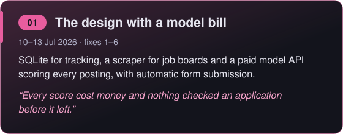</td>
    <td width="50%" valign="top">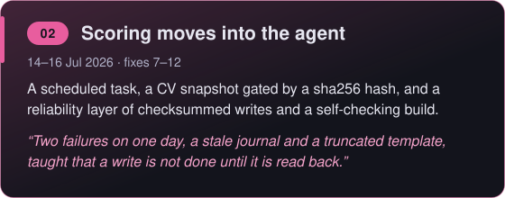</td>
  </tr>
  <tr>
    <td width="50%" valign="top">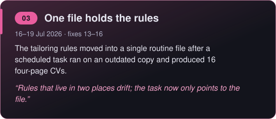</td>
    <td width="50%" valign="top">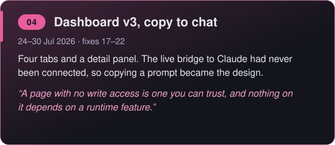</td>
  </tr>
  <tr>
    <td width="50%" valign="top">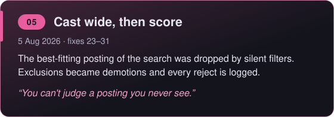</td>
    <td width="50%" valign="top">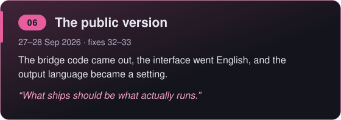</td>
  </tr>
</table>

<details>
<summary>The 6 phases as plain text</summary>

- **01 · The design with a model bill** (10–13 Jul 2026, fixes 1–6). SQLite for tracking, a scraper for job boards and a paid model API scoring every posting, with automatic form submission. *“Every score cost money and nothing checked an application before it left.”*
- **02 · Scoring moves into the agent** (14–16 Jul 2026, fixes 7–12). A scheduled task, a CV snapshot gated by a sha256 hash, and a reliability layer of checksummed writes and a self-checking build. *“Two failures on one day, a stale journal and a truncated template, taught that a write is not done until it is read back.”*
- **03 · One file holds the rules** (16–19 Jul 2026, fixes 13–16). The tailoring rules moved into a single routine file after a scheduled task ran on an outdated copy and produced 16 four-page CVs. *“Rules that live in two places drift; the task now only points to the file.”*
- **04 · Dashboard v3, copy to chat** (24–30 Jul 2026, fixes 17–22). Four tabs and a detail panel. The live bridge to Claude had never been connected, so copying a prompt became the design. *“A page with no write access is one you can trust, and nothing on it depends on a runtime feature.”*
- **05 · Cast wide, then score** (5 Aug 2026, fixes 23–31). The best-fitting posting of the search was dropped by silent filters. Exclusions became demotions and every reject is logged. *“You can't judge a posting you never see.”*
- **06 · The public version** (27–28 Sep 2026, fixes 32–33). The bridge code came out, the interface went English, and the output language became a setting. *“What ships should be what actually runs.”*

</details>

> **[CHECK]** *The "why" lines above are drafts written from STORY.md. Confirm or replace them.*

---

<a name="features"></a>
<p></p>

One HTML file with four tabs, and three routines behind it. Every screenshot uses the included demo data.

<table>
  <tr>
    <td width="33%" align="center" valign="top">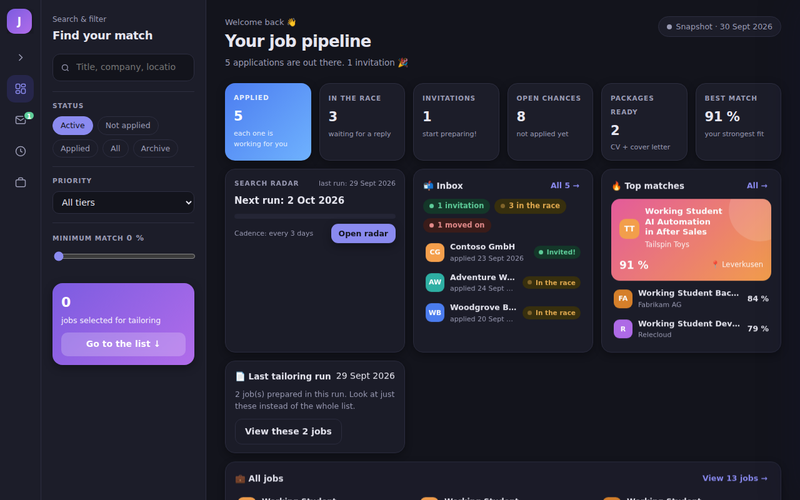<br><b>Overview</b><br><sub>counters, radar, inbox, top matches</sub></td>
    <td width="33%" align="center" valign="top">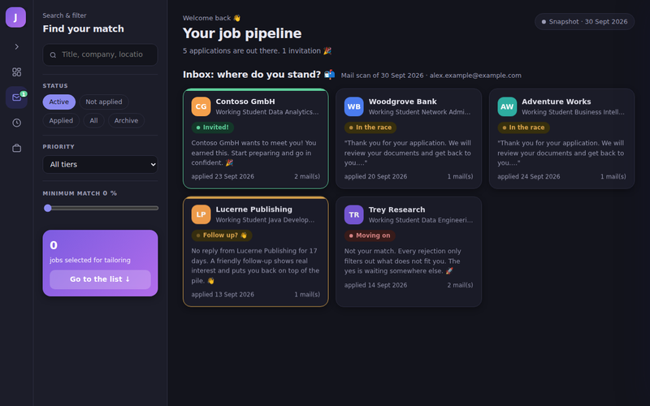<br><b>Inbox</b><br><sub>invited, waiting or rejected</sub></td>
    <td width="33%" align="center" valign="top">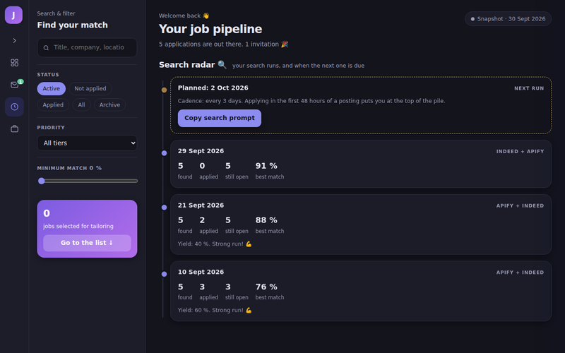<br><b>Search radar</b><br><sub>past runs and the next one due</sub></td>
  </tr>
  <tr>
    <td width="33%" align="center" valign="top">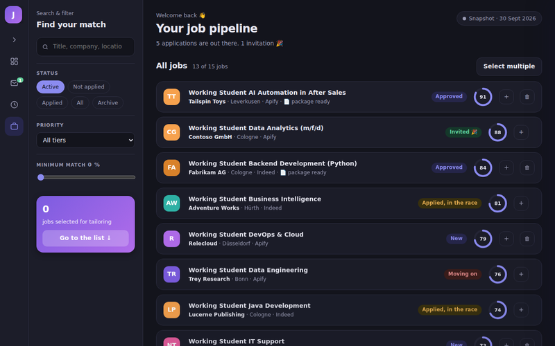<br><b>All jobs</b><br><sub>match score and status per job</sub></td>
    <td width="33%" align="center" valign="top">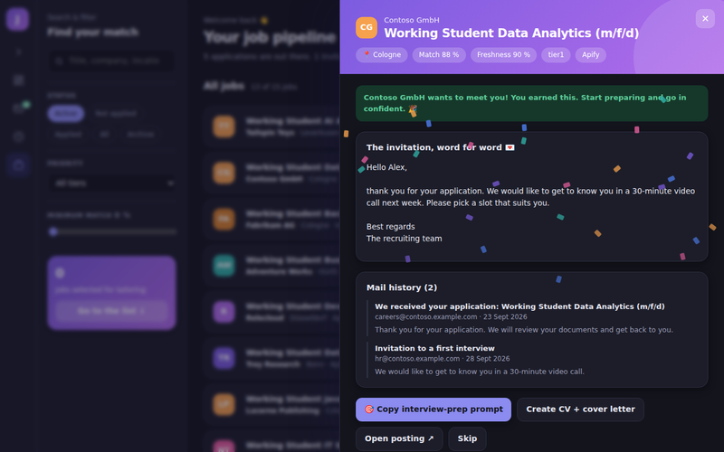<br><b>Job detail</b><br><sub>mail history and next step</sub></td>
    <td width="33%" align="center" valign="top">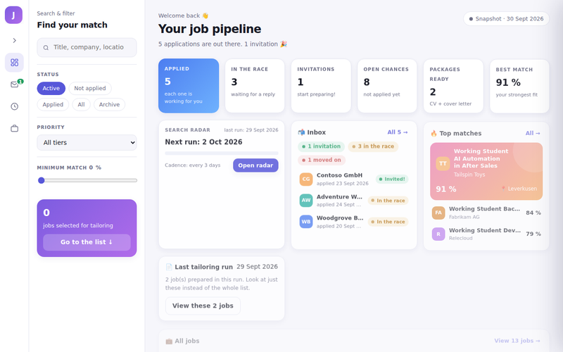<br><b>Light theme</b><br><sub>follows your system setting</sub></td>
  </tr>
</table>

Also: tailored CV and cover letter per job (optional), reply tracking from your mailbox (optional), and a spending cap on the one paid source.

<details>
<summary><b>More about each feature</b></summary>

<br>

**Search and scoring.** Two job sources, few filters, every reject logged.

- **Two job sources, one pass.** An Apify job-listing actor does a few broad sweeps; the Indeed connector runs many narrow queries. Results are deduplicated on URL **and** on normalised company + title, because some short links change between requests.
- **"Cast wide, then score."** Pre-scoring filters are few and specific, exclusions only demote, and every rejected posting is written to a log with a reason.
- **Scoring by the agent, not a script.** Each new job gets a 0–100 match score, matching and missing skills and a one-line reason, judged against a snapshot of your CV. Jobs under the threshold are never stored.
- **Cheap by design.** The CV is only re-read when its sha256 hash changes, no script calls a model, and the one paid source gets a spending cap on every call.

**Tailored applications** *(optional)*. A queued job becomes a package: a LaTeX CV cut to a hard page limit and an editable `.docx` cover letter, in the language you set in the config. The rules for both live in one routine file: truthful to your CV, no claimed specialization, content chosen per posting, layout that survives applicant-tracking systems, and a letter that tells a short story instead of listing courses.

**Reply tracking** *(optional)*. A mailbox scan by company name classifies each application as *invited*, *waiting* or *rejected* and shows it in the dashboard's inbox, with a follow-up reminder after 14 days. It only writes its own status file, never the database.

**Guardrails.**

- Rows in `jobs.db` are never deleted; only their status changes.
- Every file write is checksummed and read back; stale SQLite journals are cleaned up before connecting.
- The dashboard build refuses a truncated template, verifies its own output and prints `OK` or `BUILD FAILED`. No routine reports success without `OK`.
- Nothing is ever submitted automatically: you apply yourself.


</details>

---

<a name="learned"></a>
<p></p>

Five ideas the code shows, each with the smallest excerpt that carries it.

<details>
<summary></summary>
<br>

The agent compares one hash before doing anything expensive. If the CV is unchanged, it never opens it.

```text
Compute the sha256 of `profile/master_cv.tex` and compare it to `master_cv_sha256`  # the cheap check
- If it matches: go straight to Step B. Do NOT read master_cv.tex                    # unchanged: skip the read
- If it differs: read master_cv.tex fully, re-extract ... into cv_skills_snapshot.json  # changed: rebuild once
```

Full text: [`routines/search-jobs.md` L18–21](routines/search-jobs.md#L18-L21).

> **[CHECK]** *Why I did it this way (draft, your words):* an unchanged CV should cost nothing, and the snapshot can never drift from the CV it came from.

</details>

<details>
<summary></summary>
<br>

A write only counts once the bytes read back match what was written.

```python
expected = hashlib.sha256(data).hexdigest()               # hash what we meant to write
with open(path, "wb") as f:
    f.write(data); f.flush(); os.fsync(f.fileno())        # force it to disk
actual = hashlib.sha256(path.read_bytes()).hexdigest()    # read it back
if actual == expected:                                    # only now is it "written"
    return
```

Full code, with retries: [`core/safe_io.py` L25–50](core/safe_io.py#L25-L50).

> **[CHECK]** *Why I did it this way (draft, your words):* on a synced folder a write can "succeed" and still leave a cut-off file. This came from the 14 July incidents in the story.

</details>

<details>
<summary></summary>
<br>

The build re-reads its own output and compares it before it says `OK`.

```python
safe_write_text(OUT, rendered)                 # write with checksum
on_disk = OUT.read_text(encoding="utf-8")      # read what really landed
if on_disk != rendered:                        # compare with what we built
    raise SystemExit("BUILD FAILED: ...")      # never report a broken build as published
_check_script_balance(on_disk, "ON-DISK")      # and check the page isn't cut off mid-<script>
```

Full code: [`core/build_dashboard.py` L86–112](core/build_dashboard.py#L86-L112).

> **[CHECK]** *Why I did it this way (draft, your words):* the published dashboard once went blank because the build embedded data into a truncated template and still reported success.

</details>

<details>
<summary></summary>
<br>

Every button on the page ends in the clipboard, never in a database write.

```javascript
function copyText(text, okMsg) {
  const done = () => toast(okMsg || 'Copied ✓');                        // tell the user it worked
  if (navigator.clipboard && navigator.clipboard.writeText) {
    navigator.clipboard.writeText(text).then(done, () => fallbackCopy(text, done));  // modern path
  } else fallbackCopy(text, done);                                      // textarea fallback
}
```

Full code: [`core/dashboard_template.html` L551–563](core/dashboard_template.html#L551-L563).

> **[CHECK]** *Why I did it this way (draft, your words):* the live bridge to Claude had never been connected (29 July), and a page with no write access means a human sees every change first.

</details>

<details>
<summary></summary>
<br>

The same posting comes back with a new URL each run, so identity is the normalised company and title.

```text
Normalised company + title match against every existing row → skip.   # the identity check
Normalise by lowercasing, stripping gender markers such as (m/f/d)     # same job, same key
and punctuation, and collapsing whitespace.
```

This rule lives in routine text, not in code: [`routines/search-jobs.md` L43–46](routines/search-jobs.md#L43-L46). A code helper is on the list below.

> **[CHECK]** *Why I did it this way (draft, your words):* URL-only dedupe would have inserted six duplicates in one run.

</details>

<details>
<summary></summary>
<br>

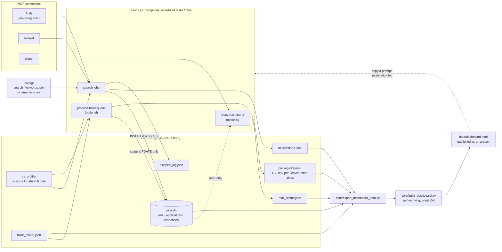

The Python side is small on purpose: five standard-library modules. The "program" is the three routine files in [`routines/`](routines/), which a Claude agent follows step by step.

</details>

---

<a name="run"></a>
<p></p>

<a name="quick-start"></a>
Quick start with the included fictional data (Python 3.9 or newer, nothing to install):

```bash
python demo/generate_demo_data.py
python core/build_dashboard.py
# open data/dashboard.html, the last line of the build must start with OK
```

<details>
<summary></summary>
<br>

The demo generator writes 15 fictional jobs, 5 applications and one interview invitation into `data/`. All companies are invented. Every button in the dashboard copies a prompt instead of changing data. To start your own search, delete `data/` and run `python core/job_database.py`. Re-running the generator with `--force` replaces whatever is in `data/`. Full walkthrough: **[docs/SETUP.md](docs/SETUP.md)**.

</details>

<details>
<summary></summary>
<br>

```bash
cp config/search_keywords.example.json config/search_keywords.json
cp config/cv_emphasis.example.json config/cv_emphasis.json   # only if you use tailoring
cp .env.example .env                                         # only to move the data folder
```

| Where | What |
|---|---|
| `config/search_keywords.json` | role type, city, radius, output language, search terms, hard filters, Apify actor and spending cap, `min_match_score` |
| `config/cv_emphasis.json` | which CV sections come first per job type |
| `.env` | `JOB_PIPELINE_DATA_DIR` only; no keys or passwords |
| `core/export_dashboard_data.py` | `MIN_MATCH_SCORE`, keep equal to `min_match_score` |

Field-by-field table: [docs/SETUP.md, section 4](docs/SETUP.md).

</details>

<details>
<summary></summary>
<br>

The routines run as Claude scheduled tasks in the desktop app, one task per routine file. Each task's prompt only points to its routine file, so the rules live in one place. Connectors (Apify, Indeed, optionally Gmail) are added in the Claude app; their logins never enter the repository. After the first run the dashboard is published as a Claude artifact, and `config/dashboard_artifact.json` holds its URL so later runs update the same page. Steps, prompts and a normal week: [docs/SETUP.md, sections 5–6](docs/SETUP.md).

</details>

<details>
<summary></summary>
<br>

| Piece | Role |
|---|---|
| [`routines/search-jobs.md`](routines/search-jobs.md) | Search both sources, filter, dedupe, score, insert, rebuild |
| [`routines/process-tailor-queue.md`](routines/process-tailor-queue.md) | *Optional.* Tailored CV + cover letter per queued job |
| [`routines/scan-mail-status.md`](routines/scan-mail-status.md) | *Optional.* Classify replies from the mailbox |
| [`core/job_database.py`](core/job_database.py) | SQLite schema + CRUD, stale-journal cleanup, `verify()` |
| [`core/safe_io.py`](core/safe_io.py) | Write → fsync → checksum → re-read → retry |
| [`core/export_dashboard_data.py`](core/export_dashboard_data.py) | Read-only export of the data layer to JSON |
| [`core/build_dashboard.py`](core/build_dashboard.py) | Embed the data into the template and verify the result |
| [`core/dashboard_template.html`](core/dashboard_template.html) | The dashboard: one file, no libraries, no network calls |
| [`demo/generate_demo_data.py`](demo/generate_demo_data.py) | A complete fictional data layer for trying it out |
| [`docs/`](docs/) | Setup guide, the build story, standalone prompts, README assets |

</details>

---

<a name="notes"></a>
<p></p>

<a name="scope"></a>
<p></p>

> **[CHECK]** *Draft, rewrite in your own words:* no credentials are stored in the repository (connector logins live in the Claude app, `.env` holds only a folder path), your CV, config and `data/` are git-ignored, and nothing is submitted for you. The dashboard is a single local file with no network calls. Nothing here protects data on a shared or synced machine beyond that.

<a name="limitations"></a>
<p></p>

- The dedupe normalisation lives in the routine text, not in code, and there are no automated tests.
- Some setup steps in the guide describe screens in the Claude app that were not checked click by click.
- Both job sources are mandatory: if Indeed isn't available to you, you have to edit the routine.
- The dashboard is English only, and its light and dark themes follow the system setting.

<a name="license"></a>
<p></p>

> **[CHECK]** There is no `LICENSE` file in the repository yet. Add one and name it here.
