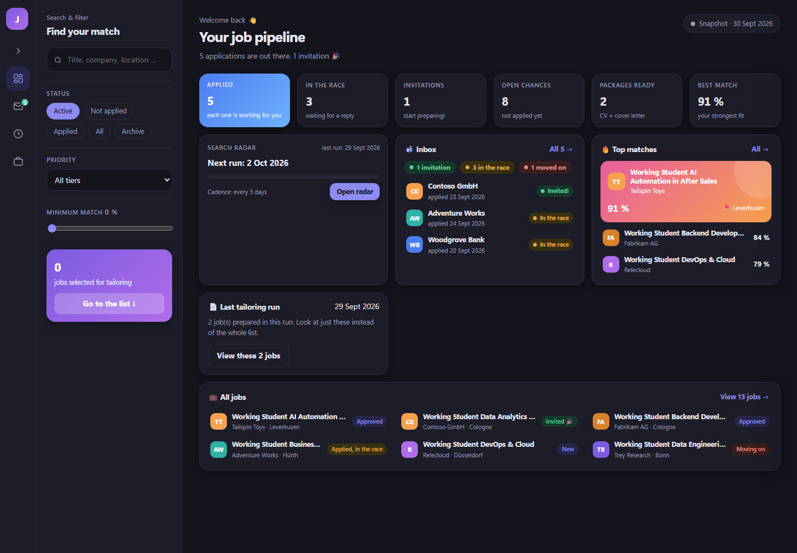

# Setup guide

A step-by-step guide for someone who has never seen this repository. Plan about an hour for the first setup; most of it is filling in your own CV and search settings.

Some steps describe screens in the Claude app that haven't been checked click by click yet. The goal of each step is clear; the exact button names may differ.

---

## 1. What you get at the end

A job search that runs as Claude tasks on your own computer. One task searches two job sources, filters and deduplicates the results, and scores every new posting against your CV. You review the matches in a dashboard, pick the ones you like, and a second task writes a tailored CV and an editable cover letter for each. An optional third task checks your mailbox for replies. Everything lives in one SQLite file and one dashboard page; nothing is sent anywhere on its own, and you always apply yourself.



*The dashboard, built from the included demo data. All companies are fictional.*

---

## 2. Requirements

| You need | Why | Notes |
|---|---|---|
| **A Claude plan with scheduled tasks and connectors** | the routines run as scheduled tasks and use connectors | check your plan's feature list <!-- TODO WALID: verify in app: which plans include scheduled tasks and custom connectors --> |
| **The Claude desktop app** | scheduled tasks run there, with access to a folder on your computer | Windows or macOS |
| **Python 3.9 or newer** | the scripts in `core/` and `demo/` | standard library only, nothing to install with pip |
| **Git** | to clone the repository | or download it as a ZIP |
| **An Apify account** | job source 1 | the job-listing actor you choose may charge per result |
| **An Indeed connector** | job source 2 | |
| **A Gmail account** *(optional)* | reply tracking | the mailbox you apply from |
| **LaTeX + poppler** *(optional)* | turning tailored CVs into PDFs | `tectonic` or `pdflatex`, plus `pdfinfo`/`pdftotext`. Without them you get the `.tex` source only |

You do **not** need an Anthropic API key. No script in this repository calls a model; all the thinking happens inside your Claude tasks.

Check your Python version:

```bash
python --version
```

---

## 3. Install and run the demo

All commands run from the repository root, the cloned `job-pipeline` folder. All paths in this guide are relative to it.

```bash
git clone <repo-url> job-pipeline && cd job-pipeline
python demo/generate_demo_data.py
python core/build_dashboard.py
```

The last command must end with a line like:

```text
OK data/dashboard.html (97410 bytes, 15 jobs verified on disk)
```

Anything else (especially `BUILD FAILED`) means the build did not work. Now open `data/dashboard.html` in your browser. You should see the dashboard from the screenshot, with 15 fictional jobs, 5 applications and one interview invitation. Click around: every button copies a prompt to your clipboard instead of changing data. That is on purpose (see section 6).

When you're done looking, delete the demo data and create an empty database for your own jobs:

```bash
rm -r data
python core/job_database.py
```

(On Windows PowerShell: `Remove-Item -Recurse data`, then the second line.) If you ever want the demo back, run `python demo/generate_demo_data.py --force`, but note that it replaces whatever is in `data/`.

---

## 4. Make it yours

### 4.1 Your CV

```bash
mkdir profile
cp templates/master_cv.example.tex profile/master_cv.tex
```

Open `profile/master_cv.tex` and replace the demo person with yourself. Keep it **complete**: every project, job, certificate and skill you have. The tailoring task does the cutting for each job; it can only pick from what's in here. The file stays on your computer: `profile/` is in `.gitignore`.

On the first search run, Claude reads this file once and builds a profile snapshot in `data/cv_profile/`. After that it only re-reads the CV when the file actually changes.

### 4.2 Search settings

```bash
cp config/search_keywords.example.json config/search_keywords.json
```

Open `config/search_keywords.json` and fill in these fields. Each has a comment in the file explaining why it's there.

| Field | What it is | Example |
|---|---|---|
| `target.role_type` | the kind of position | `"working student"` |
| `target.home_location` | the city you search around | `"Cologne"` |
| `target.country_code` | two-letter country code | `"DE"` |
| `target.location_radius_km` | maximum distance | `40` |
| `target.output_language` | language of your CVs, cover letters and the match reasoning | `"German"` |
| `broad_sweeps.apify` | 2-4 **bare** employment-type terms for the broad source | `["Working Student", "Werkstudent"]` |
| `priority_searches.indeed` | many **narrow** queries (keywords) for Indeed | `["Working Student Data", "Working Student Python"]` |
| `hard_filters.must_contain_one_of` | at least one of these must appear in title or description | `["working student", "werkstudent"]` |
| `hard_filters.title_exclude` | specific phrases that demote a posting | `["sales manager", "recruiting"]` |
| `hard_filters.title_exclude_override.tokens` | words that cancel the exclusion | `["data", "python", "support"]` |
| `hard_filters.max_days_posted` | oldest posting you still want | `10` |
| `hard_filters.location_include` / `location_exclude` | places that always / never pass | `["Bonn", "Leverkusen"]` / `["Aachen"]` |
| `apify.actor_id` | any Apify actor that returns job listings | `"<username>/<job-listing-actor>"` |
| `apify.actor_input` | the actor's own input fields (see its input schema) | `{"maxItems": 100}` |
| `apify.max_total_charge_usd` | hard spending cap per actor call | `0.5` |
| `indeed.location` / `indeed.country_code` | location for the Indeed search | `"Köln"` / `"DE"` |
| `min_match_score` | jobs scoring below this are never stored | `50` |

If you change `min_match_score`, change `MIN_MATCH_SCORE` in `core/export_dashboard_data.py` to the same value: the dashboard uses it as a second safety net.

### 4.3 CV emphasis (only if you use tailoring)

```bash
cp config/cv_emphasis.example.json config/cv_emphasis.json
```

It maps job types (backend, data, devops, …) to the CV sections and skills to put first. Rename the section names so they match the headings in your own CV. It's a hint for Claude, not a strict rule.

### 4.4 Environment (optional)

Only needed if your data should live somewhere other than `data/`:

```bash
cp .env.example .env
```

and set `JOB_PIPELINE_DATA_DIR`. No keys or passwords go into this file.

---

## 5. Connectors

The routines use connectors in the Claude app. Your Apify token and your Indeed and Gmail logins are stored in Claude's connector settings, never in this repository.

### 5.1 Apify (required)

Used by the search task (tools `call-actor` and `get-dataset-items`).

1. Create an account on apify.com and pick a job-listing actor. Note its ID for `apify.actor_id`.
2. In the Claude desktop app, open **Settings → Connectors**. <!-- TODO WALID: verify in app: exact menu path -->
3. Add Apify, either from the connector directory or as a custom connector with the server URL `https://mcp.apify.com`. <!-- TODO WALID: verify in app: whether Apify is listed in the directory, and the exact "add custom connector" wording -->
4. Sign in to Apify when asked. <!-- TODO WALID: verify in app: whether it asks for a sign-in or an API token -->

### 5.2 Indeed (required)

Used by the search task (`search_jobs`) and by tailoring when a job description is missing (`get_job_details`).

1. In **Settings → Connectors**, add the Indeed connector from the directory. <!-- TODO WALID: verify in app: that Indeed is listed, its name, and any sign-in step -->

If Indeed isn't available to you, the search task will report every run as failed (both sources are mandatory). Remove step A2 from your copy of `routines/search-jobs.md` in that case.

### 5.3 Gmail (optional)

Used only by the mail-scan task.

1. In **Settings → Connectors**, add Gmail and sign in with the mailbox you send applications from. <!-- TODO WALID: verify in app: connector name and sign-in flow -->

### 5.4 Folder access

The tasks read and write files in this repository. Give Claude access to the `job-pipeline` folder. <!-- TODO WALID: verify in app: where folder access is granted for scheduled tasks -->

---

## 6. Scheduled tasks in Cowork

Create **one scheduled task per routine** in Cowork. <!-- TODO WALID: verify in app: the exact place to create a scheduled task, and how to set it to "manual" (no schedule) -->

Paste the prompt below as the task's instructions. Replace `<path-to-repo>` with the folder you cloned into. Keep the prompt this short: it only points to the routine file, so the rules live in exactly one place and your task can never run an outdated copy.

### Task 1: `search-jobs`

```text
You are running the search-jobs routine of the job pipeline in <path-to-repo>.
Read routines/search-jobs.md now, in full, and follow it exactly.
If the file is missing or incomplete, stop and report that instead of improvising.
Finish with the report that the file's "Report" section asks for.
```

**When:** manually, about every 3 days. The dashboard's search radar shows when the next run is due. Fresh postings get the most replies.

### Task 2: `process-tailor-queue` *(optional)*

```text
You are running the process-tailor-queue routine of the job pipeline in <path-to-repo>.
Read routines/process-tailor-queue.md now, in full, and follow it exactly.
If the file is missing or incomplete, stop and report that instead of improvising.
Finish with the report that the file's "Report" section asks for.
```

**When:** manually, after you have picked jobs in the dashboard (see below).

### Task 3: `scan-mail-status` *(optional)*

```text
You are running the scan-mail-status routine of the job pipeline in <path-to-repo>.
Read routines/scan-mail-status.md now, in full, and follow it exactly.
If the file is missing or incomplete, stop and report that instead of improvising.
Finish with the report that the file's "Report" section asks for.
```

**When:** manually after you've sent applications, or on a schedule you choose (for example once a week).

### The first dashboard publish

The tasks publish `data/dashboard.html` as a Claude artifact so you can open it from anywhere in the app. After the first successful run:

```bash
cp config/dashboard_artifact.example.json config/dashboard_artifact.json
```

and put the artifact's URL or ID into the `url` field. From then on every task updates that same artifact instead of creating a new one. <!-- TODO WALID: verify in app: where to find the artifact's URL -->

### A normal week

1. **Search:** run `search-jobs`. Its report lists what each source found, what the filters dropped, and the top 3 matches.
2. **Review:** open the dashboard. Approve, skip or discard jobs. Each button copies a prompt: paste it into a Claude chat in this project and Claude makes the change. The dashboard itself can't change anything.
3. **Tailor:** select jobs with **+**, click **Copy prompt for Claude** in the tray at the bottom, paste it into the chat. That adds them to the queue and runs `process-tailor-queue`.
4. **Apply:** yourself, with the files from `data/packages/`. Check and edit the cover letter first; it's a Word file for that reason.
5. **Track:** run `scan-mail-status`. Invitations, rejections and follow-up reminders show up in the dashboard's Inbox tab.

---

## 7. Folder map

```text
job-pipeline/
├── profile/
│   └── master_cv.tex            your complete CV, the source for everything (private, not in git)
├── config/
│   ├── search_keywords.json     search terms, filters, city, language, score threshold (private)
│   ├── cv_emphasis.json         which CV sections to put first per job type (private)
│   ├── dashboard_artifact.json  which artifact the tasks update (private)
│   └── *.example.json           the templates you copied these from
├── data/                        everything the pipeline creates (private, not in git)
│   ├── jobs.db                  the database: jobs, applications, replies; rows are never deleted
│   ├── descriptions.json        full job descriptions, by job id
│   ├── cv_profile/
│   │   ├── cv_skills_snapshot.json   your CV as structured data, used for scoring and tailoring
│   │   └── cv_snapshot_meta.json     the CV's hash: when it changes, the snapshot is rebuilt
│   ├── skipped_log.json         every posting the filters rejected, with the reason (last 3 runs)
│   ├── tailor_queue.json        jobs waiting for a tailored CV + cover letter
│   ├── status_changes.json      queued status changes (applied by the tailoring task)
│   ├── mail_status.json         reply status per application (from the mail scan)
│   ├── dashboard_data.json      export of the data for the dashboard (generated)
│   ├── dashboard.html           the dashboard page (generated)
│   └── packages/
│       ├── <id>_<company>/      one application: cv_tailored.tex, CV_<Company>.pdf,
│       │                        cover_letter.docx, meta.json (change log), build/ (LaTeX leftovers)
│       └── _archived/           packages of jobs you've applied to, moved here automatically
├── routines/                    the instructions each task follows (edit these to change behaviour)
├── core/                        the Python scripts and the dashboard template
├── templates/                   master_cv.example.tex: a demo CV to start from
├── demo/                        generate_demo_data.py: fictional data for trying it out
└── docs/                        this guide, the story, screenshots, standalone prompts
```

---

## 8. How to change things

| You want to change | Edit this | Where exactly |
|---|---|---|
| Search terms | `config/search_keywords.json` | `broad_sweeps.apify` (bare terms), `priority_searches.indeed` (narrow queries) |
| Filters (age, places, excluded words) | `config/search_keywords.json` | `hard_filters` |
| City, radius, role type | `config/search_keywords.json` | `target` |
| Scoring threshold | `config/search_keywords.json` **and** `core/export_dashboard_data.py` | `min_match_score` and `MIN_MATCH_SCORE`: keep them equal |
| How jobs are scored | `routines/search-jobs.md` | Step D |
| CV rules (length, layout, wording) | `routines/process-tailor-queue.md` | the `cv_tailored.tex` section in Step B |
| Which CV sections come first | `config/cv_emphasis.json` | per job type |
| Cover letter rules | `routines/process-tailor-queue.md` | the `cover_letter.docx` section in Step B |
| Output language | `config/search_keywords.json` | `target.output_language` |
| Mail classification | `routines/scan-mail-status.md` | step 3 |
| Search reminder (every 3 days) or follow-up reminder (14 days) | `core/dashboard_template.html` | `SEARCH_CADENCE_DAYS`, `FOLLOWUP_DAYS` |
| Your CV content | `profile/master_cv.tex` | the whole file; the snapshot updates on the next run |

After editing a routine, you don't need to touch the scheduled task: it reads the routine file fresh on every run. After changing data or the dashboard template by hand, rebuild with `python core/build_dashboard.py`.

---

## Appendix: just the prompts

If you only want the prompts, without the pipeline, [`docs/prompts/`](prompts/) has three standalone versions to paste into any Claude chat: job search, CV tailoring and motivation letter. Each lists every value you need to fill in, with an example.
